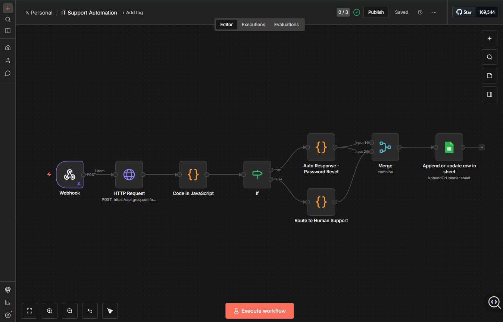
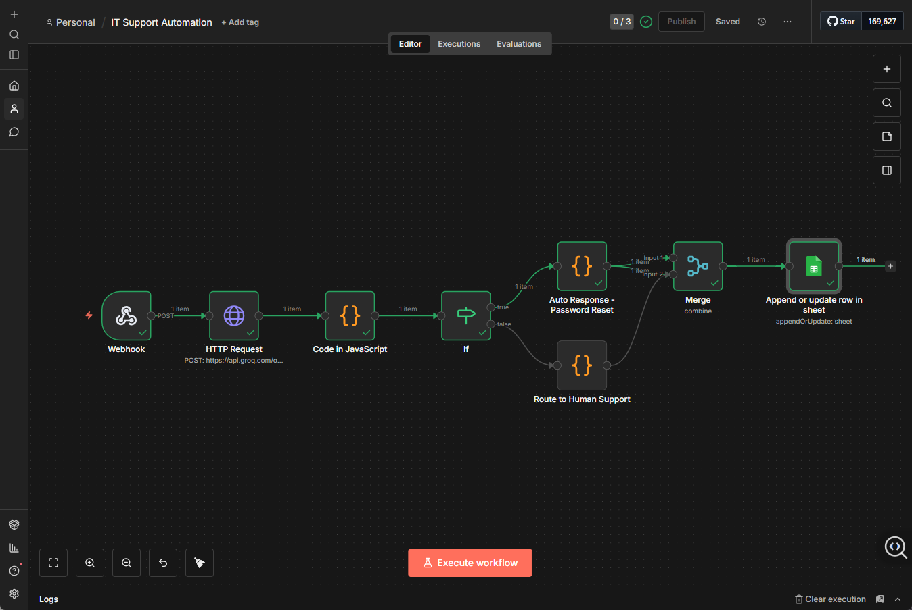
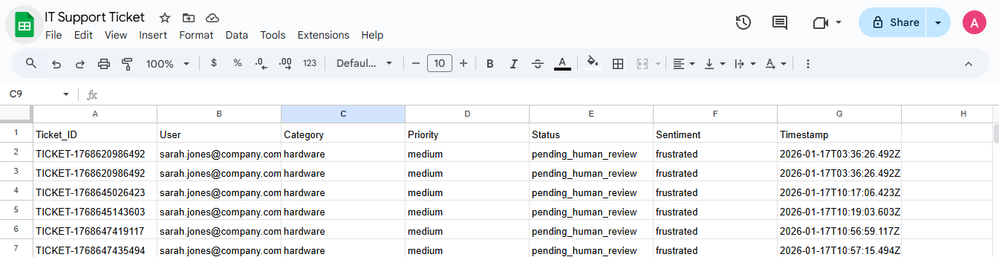

# AI-Powered IT Support Automation


An intelligent IT support ticketing system that uses AI to automatically triage, categorize, and resolve common support requests, reducing response time and improving efficiency.

## Features

- **Intelligent Ticket Triage**: Uses AI (Groq LLaMA) to analyze and categorize incoming support tickets
- **Automated Resolution**: Automatically resolves common issues like password resets
- **Smart Routing**: Routes complex issues to human support with AI-generated suggestions
- **Priority Detection**: Identifies urgent tickets based on content and sentiment analysis
- **Comprehensive Logging**: Tracks all tickets in Google Sheets for reporting and analytics

## Architecture
```
Support Ticket (Webhook) 
    ↓
AI Analysis (Groq LLaMA 3.3)
    ↓
Decision Logic (IF Node)
    ↓
├─→ Auto-Resolve (Password Resets, etc.)
└─→ Route to Human (Complex Issues)
    ↓
Google Sheets Logging
```

## Use Cases

- **Password Resets**: Instantly provides reset links and instructions
- **Hardware Issues**: Routes to technical team with AI diagnostic suggestions
- **Software Requests**: Categorizes and prioritizes based on urgency
- **Network Problems**: Escalates critical connectivity issues

## Tech Stack

- **n8n**: Workflow automation platform
- **Groq API**: Fast AI inference (LLaMA 3.3 70B)
- **Google Sheets**: Ticket logging and analytics
- **Webhook**: RESTful API endpoint for ticket submission

## Prerequisites

- n8n installed (local or cloud)
- Groq API account (free tier available)
- Google account for Sheets integration

## Setup Instructions

See [SETUP.md](SETUP.md) for detailed installation steps.

## Screenshots

### Workflow Overview

*Complete n8n workflow showing AI triage, decision logic, and automated responses*

### Successful Execution

*Workflow execution showing all nodes processing successfully*

### Ticket Logging

*Automated ticket logging in Google Sheets with categorization and status*

### Sample Output
**Auto-Resolved Ticket (Password Reset):**
- Status: `auto_resolved`
- Response time: Immediate
- AI provides reset instructions automatically

**Human Review Ticket (Hardware Issue):**
- Status: `pending_human_review`
- AI provides diagnostic suggestions
- Routed to the technical support team

## Security Notes

- Never commit actual API keys to the repository
- Use environment variables for all credentials
- Rotate API keys regularly
- Restrict webhook access in production

## Future Enhancements

- [ ] Integration with Jira/ServiceNow
- [ ] Email trigger support
- [ ] Multi-language support
- [ ] Advanced analytics dashboard
- [ ] Machine learning for better categorization
- [ ] SLA tracking and alerts

## Contributing

Contributions welcome! Please open an issue or submit a pull request.

<p align="center">
  <em>⭐ If you find this project helpful, please star the repository!</em>
</p>
